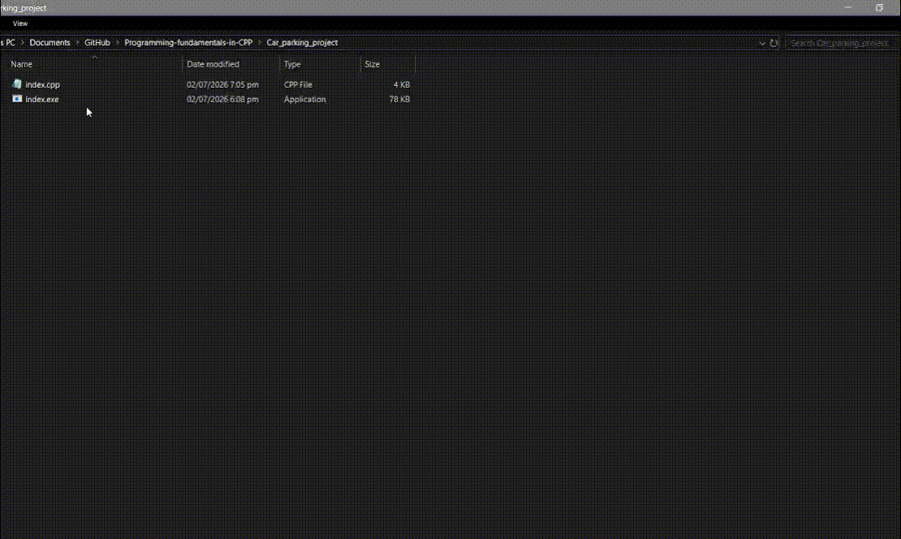

# Parkello
This is a terminal based app Car Parking Management System designed to help the parking operator by managing the arrival and departure of vehicles, maintaining the log history, and calculating fees.

### How I made it:
I am combining all the foundational concepts I've been teaching myself:
* The use of **cout** to print the menu. Tap [--> here <--](demo/ScreenShorts/menu(cout).png) to see code screenshot.
* **cin** to get user input. Tap [--> here <--](demo/ScreenShorts/cin(user_Input).png) to see code screenshot.
* **while(true) loop** to display the menu again and again. Tap [--> here <--](demo/ScreenShorts/loop.png) to see code screenshot.
* **if-else statements** to respond to user input. Tap [--> here <--](demo/ScreenShorts/loop.png) to see code screenshot.

### Project Roadmap & Phases:
I divided the project into 5 phases/milestones:
* **Phase 1 (Done):** The interactive menu and options navigation are working completely fine!
* **Phase 2 (Done):** The mathematical calculations using variables like `totalAmount`, `totalVehicles`, `bikeCount`, and `carCount` to track arrivals and departures in real-time are completely implemented!
* **Phase 3 (Current):** The 3rd phase will be about adding the authentication mechanism for the operator to login using username and password.
* **Phase 4:** The 4th phase will be about adding the functionality of file management to securely save and load the logs directly from local text files.

### Live Demo Loop
Here is a preview of the interactive workspace layout running natively:

# How to run and test
I compiled a ready-to-run `index.exe` file which anyone can download by clicking [--> here <--](https://github.com/ArfaMariyam/Parkello/releases) and just double-click it to run and test.